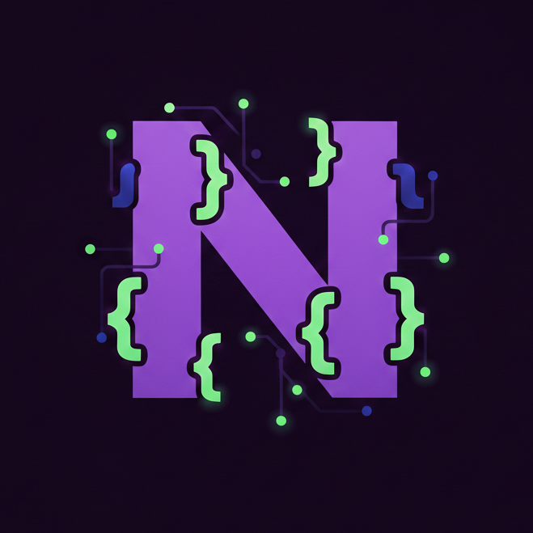

<p align="center">
  
</p>

<h1 align="center">NvimVoice</h1>

<p align="center">
  <strong>Learn and remember Neovim keybindings with your voice.</strong>
</p>

<p align="center">
  
  
  
</p>

<p align="center">
  <a href="https://nvim-voice.vercel.app"><strong>Landing Page</strong></a> ·
  <a href="https://github.com/victorgalvez56/nvim-voice/releases">Download</a> ·
  <a href="https://buymeacoffee.com/victorgalvez">Buy me a coffee</a>
</p>

---

NvimVoice is a macOS menu bar app that teaches you Neovim/LazyVim keybindings using your voice. Press a hotkey, describe what you want to do, and see the exact keys to press — step by step, with visual context from your editor. It doesn't type for you. It teaches you.

<!-- screenshot placeholder -->
<!--  -->

## How It Works

1. Press **Cmd+Shift+V** (global hotkey).
2. Speak your command (e.g. "find files in this project").
3. Press **Cmd+Shift+V** again to stop recording.
4. Whisper transcribes the audio locally.
5. A screenshot of your editor is captured.
6. GPT-4 Vision analyzes transcription + screenshot + available keybindings.
7. A floating overlay shows the key sequence (e.g. `<leader>ff`), explanation, and alternatives.

## Features

- **Voice to Keybindings** — Press Cmd+Shift+V, speak a command, get the exact Neovim/LazyVim keybinding.
- **Local Transcription** — Whisper runs locally via WhisperKit. No audio sent to the cloud.
- **Visual Context** — Captures your screen and uses GPT-4 Vision to understand your editor state.
- **Dynamic Island Overlay** — Floating pill with key sequence, step-by-step instructions, and alternatives.
- **ZSA Keyboard Support** — Physical key positions for Moonlander, Voyager, and ErgoDox EZ via [Keymapp](https://www.zsa.io/flash).
- **LazyVim Aware** — Parses your Neovim config and merges it with LazyVim defaults.
- **Secure Storage** — API key encrypted with AES-GCM using hardware UUID.
- **Debug Logging** — Structured logs at `~/.config/nvimvoice/debug.log`.

## Installation

### Download

Grab the latest `.dmg` from the [Releases](https://github.com/victorgalvez56/nvim-voice/releases) page.

### Build from Source

```bash
git clone https://github.com/victorgalvez56/nvim-voice.git
cd nvim-voice

# Build and install to /Applications
make install

# Or run in dev mode
make dev
```

## Makefile Commands

| Command | Description |
|---------|-------------|
| `make dev` | Debug build + codesign + relaunch |
| `make watch` | Auto-rebuild on .swift changes |
| `make build` | Release build |
| `make bundle` | Create app bundle |
| `make run` | Bundle + launch |
| `make install` | Copy to /Applications |
| `make dmg` | Create distributable .dmg |
| `make clean` | Clean build artifacts |
| `make web-dev` | Run landing page dev server |
| `make web-build` | Build landing page for static hosting |

## Required Permissions

| Permission | Reason |
|------------|--------|
| Microphone | Record voice commands |
| Screen Recording | Capture visual context from the editor |
| Accessibility | Global hotkey (Cmd+Shift+V) |

## Configuration

Configure the app from the menu bar → Settings:

- **General** — Whisper model (tiny/base/small), overlay duration, image detail level.
- **Keyboard** — Auto-detected ZSA keyboard layout, model, and layer count.
- **API** — OpenAI API key (stored encrypted at `~/.config/nvimvoice/.api-key`).

## Tech Stack

| Component | Technology |
|-----------|-----------|
| Language | Swift 5.9+ |
| Platform | macOS 14.0+ (Sonoma) |
| UI | SwiftUI (MenuBarExtra + NSPanel) |
| Transcription | WhisperKit (local Whisper) |
| AI | OpenAI GPT-4 Vision (gpt-4o) |
| Audio | AVAudioEngine (16kHz mono Float32) |
| Screen Capture | ScreenCaptureKit |
| Security | CryptoKit (AES-GCM) |
| Build | Swift Package Manager + Makefile |

## Project Structure

```
NvimVoice/
├── NvimVoice/              # Swift source
│   ├── App/                # App entry point, menu bar
│   ├── Models/             # Data models, prompts
│   ├── Services/           # Audio, AI, screen capture, keyboard
│   ├── UI/                 # SwiftUI views (overlay, settings, onboarding)
│   └── Resources/          # Plist, entitlements, assets
├── web/                    # Next.js landing page
│   ├── app/                # App router pages
│   └── components/         # React components
├── Package.swift
├── Makefile
└── README.md
```

## License

MIT
